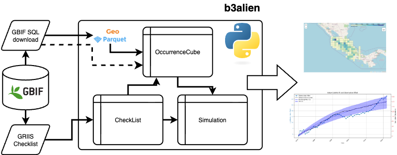

.. b3alien documentation master file, created by
   sphinx-quickstart on Fri May  9 10:21:09 2025.
   You can adapt this file completely to your liking, but it should at least
   contain the root `toctree` directive.

Welcome to b3alien's documentation!
===================================

.. toctree::
   :maxdepth: 2
   :caption: Contents:

   modules

Introduction
------------

The historic Kunming-Montreal Global Biodiversity
Framework, which supports the achievement of the
Sustainable Development Goals and builds on the
Convention on Biological Diversity’s (CBD) previous
Strategic Plans, sets out an ambitious pathway to reach
the global vision of a world living in harmony with nature
by 2050. Among the Framework’s key elements are 23
targets for 2030. In order to track the progress on the
targets, a number of indicators were agreed upon for
each target. The B3ALIEN software provides a technical
solution to track Target 6: “Reduce the Introduction of
Invasive Alien Species by 50% and Minimize Their
Impact.” It mainly focusses on the headline indicator: rate
of invasive alien species establishment, but can provide
input to some of the complementary indicators.

Decision makers at local, regional, national and
international levels need accurate and reliable
information about status, trends, threats, and they need
data presented in an actionable and understandable
format, with measures of uncertainty. Furthermore, we
need synthesized data products that can be combined
with other environmental data, such as climate, soil
chemistry, land use, altitude... B3ALIEN is built upon the
concept of data cubes developed in the Horizon Europe
Biodiversity Building Blocks for Policy project (b-
cubed.eu). It uses the solid foundations of the GBIF
infrastructure, where tools such as the GBIF Taxonomic
Backbone and the Global Registry of Introduced and
Invasive Species are available by default. Readily available occurrence data is used to determine and estimate
accurately the rate of introduction of alien species..

Architecture
============

Example usage
=============

.. code-block:: python

    from b3alien import b3cube
    from b3alien import visualisation
    from b3alien.utils.runtime import in_jupyter
    from b3alien import griis
    from b3alien import simulation

    import matplotlib
    matplotlib.use("TkAgg")

.. code-block:: python

    cube = b3cube.OccurrenceCube("gs://b-cubed-eu/data_PT-30b.parquet", gproject='$GPROJECT-ID')

.. code-block:: python

    print(cube.df)

.. code-block:: text

           kingdom  kingdomkey           phylum  phylumkey              class  \
    0      Plantae           6       Charophyta    7819616       Charophyceae   
    1      Plantae           6     Tracheophyta    7707728     Polypodiopsida   
    ...
    52191  Plantae           6        Bryophyta         35          Bryopsida   
    
           classkey            order  orderkey          family  familykey  ...  \
    0           328         Charales       626       Characeae       8782  ...   
    ...
    52191       327        Pottiales       621      Pottiaceae       4671  ...   
    
          classcount  ordercount familycount genuscount distinctobservers  \
    0              1           1           1          1                 1   
    ...
    52191          4           1           1          1                 1   
    
          occurrences  mintemporaluncertainty  mincoordinateuncertaintyinmeters  \
    0               1                 2678400                            1000.0   
    ...
    52191           1                   86400                              30.0   
    
               cellCode                                           geometry  
    0      W016N32ACAAA  POLYGON ((-17 32.71875, -16.96875 32.71875, -1...  
    ...
    52191  W017N32BBCAD  POLYGON ((-17.21875 32.8125, -17.1875 32.8125,...  
    
    [52192 rows x 28 columns]

.. code-block:: python

    cube._species_richness()

.. code-block:: python

    print(cube.richness)

.. code-block:: text

                 cell  richness
    0    W016N30DDDDA         3
    1    W016N32AACAC       212
    ...
    124  W017N32BDBDD        91
    
    [125 rows x 2 columns]

.. code-block:: python

    b3cube.plot_richness(cube.richness, cube.df)

.. image:: _static/images/richness_plot.png

.. code-block:: python

    CL = griis.CheckList("$YOUR_DIRECTORY/merged_distr.txt")

.. code-block:: python

    d_s, d_c = b3cube.cumulative_species(cube, CL.species)

.. code-block:: python

    time, rate = b3cube.calculate_rate(d_c)

.. code-block:: python

    C1 = simulation.simulate_solow_costello(time, rate, vis=True)

.. code-block:: text

    Optimization terminated successfully.
         Current function value: -263.092115
         Iterations: 172
         Function evaluations: 287

.. image:: _static/images/output_9_2.png

Acknowledgements
----------------
This software was developed under the B3 project. B3 (Biodiversity Building Blocks for policy) receives funding from the 
European Union’s Horizon Europe Research and Innovation Programme (ID No 101059592). 
Views and opinions expressed are however those of the author(s) only and do not necessarily reflect those of the 
European Union or the European Commission. Neither the EU nor the EC can be held responsible for them.

OccurrenceCube Class
====================

.. autoclass:: b3alien.b3cube.OccurrenceCube
   :members:
   :private-members:
   :undoc-members:
   :show-inheritance:

.. automodule:: b3alien.b3cube
   :members:
   :undoc-members:
   :show-inheritance:

GRIIS checklist class
=====================

.. autoclass:: b3alien.griis.CheckList
   :members:
   :private-members:
   :undoc-members:
   :show-inheritance:

.. automodule:: b3alien.griis
   :members:
   :undoc-members:
   :show-inheritance:

B3 visualisation
================

.. automodule:: b3alien.visualisation
   :members:
   :undoc-members:
   :show-inheritance:

Simulation module
=================

.. automodule:: b3alien.simulation
   :members:
   :undoc-members:
   :show-inheritance:

Indices and tables
==================

* :ref:`genindex`
* :ref:`modindex`
* :ref:`search`
